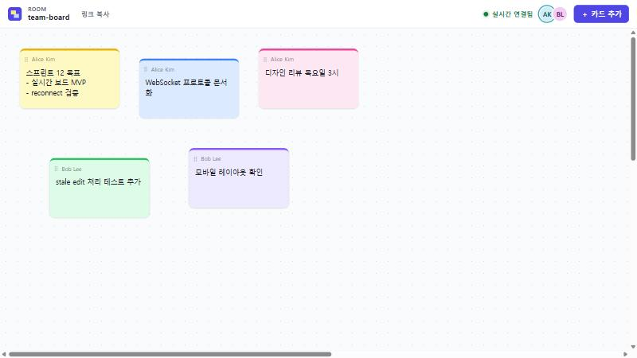
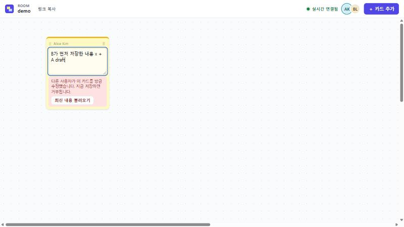
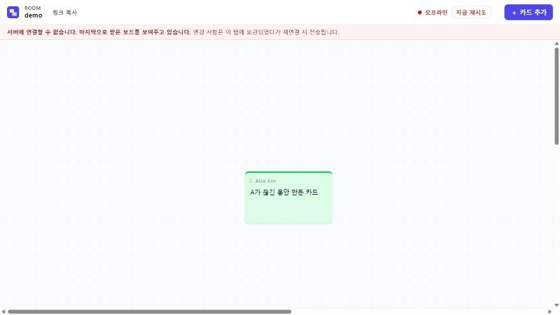
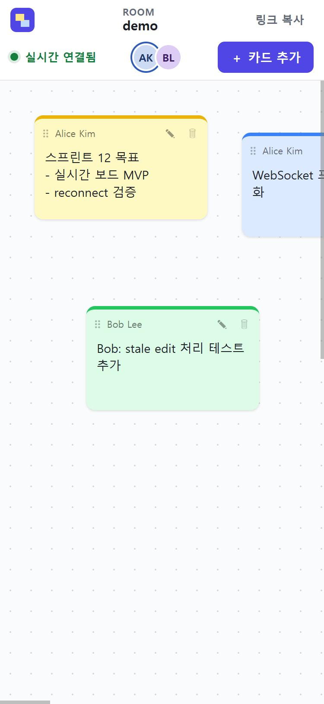

# realtime-collab-board

[](https://github.com/Jebipro/realtime-collab-board)
[](https://github.com/Jebipro/realtime-collab-board/actions/workflows/ci.yml)
[](LICENSE)

같은 URL(room)에 접속한 여러 사용자가 카드와 접속자(presence)를 실시간으로 공유하는 작은 협업 보드입니다.
Trello와 가벼운 FigJam 사이 정도의 범위로, **실시간 동기화·optimistic UI·재연결 처리**를 직접 구현하는 데 집중했습니다.



## 문제

"같은 room에 접속한 두 사용자가 카드와 presence를 실시간으로 공유할 수 있는가?"

- 내 조작은 서버 응답을 기다리지 않고 즉시 반영되어야 한다 (optimistic).
- 그러면서도 최종 상태는 서버가 결정해야 하고, 충돌 시 결과를 예측할 수 있어야 한다.
- 연결이 끊겨도 상태를 숨기지 않고, 재연결 후 서버 상태로 정확히 복구해야 한다.

CRDT·auth·DB 없이, 설명 가능한 단순한 프로토콜로 이를 해결합니다.

## 실행

```bash
npm install
npm run dev        # server(:8790) + Vite(:5180) 동시 실행
```

브라우저에서 `http://localhost:5180` → 새 room으로 이동합니다. 같은 주소를 다른 탭/브라우저에서 열면 함께 편집됩니다.
(탭마다 별도 참가자로 취급됩니다. 이름은 브라우저 localStorage에 기억됩니다.)

```bash
npm test           # vitest (단위 + WebSocket 통합 테스트)
npm run build      # 타입체크 + 클라이언트 빌드 → dist/
npm start          # dist/를 서빙하는 단일 서버 (PORT 기본 8790)
```

## 아키텍처

```
shared/            서버·클라이언트 공용
  protocol.ts      메시지 타입 + 입력 검증 (라이브러리 없음)
  board.ts         applyOp(): 순수 상태 전이 함수 — 서버 확정 적용과 클라이언트 optimistic 재생에 같은 코드 사용
server/
  room.ts          Room: 권위 있는 카드 상태, room revision, opId 중복 제거, presence (전송 계층 무관 → 단위 테스트 용이)
  app.ts           node:http + ws. /ws 프로토콜, heartbeat(ping 15s), dist 정적 서빙 + SPA fallback
src/
  sync/syncState.ts   클라이언트 동기화 모델 (순수 함수)
  sync/BoardClient.ts 소켓 수명주기·backoff·재전송, useSyncExternalStore용 store
  components/         TopBar(room/연결/참가자), BoardView, CardView(drag·편집·키보드)
```

- 상태 관리 라이브러리는 쓰지 않았습니다. `BoardClient`가 불변 snapshot을 내보내고 React는 `useSyncExternalStore`로 구독합니다.
- **board 데이터(`sync`)와 연결 상태(`connection`)는 분리**되어 있습니다. 연결이 끊겨도 마지막 보드는 그대로 보입니다.
- 보드는 free board(x, y) 하나입니다. column/정렬 대신 자유 배치를 택한 이유: drag 구현이 단순하고 pointer events로 터치까지 같은 코드로 처리됩니다.

## WebSocket 프로토콜

모든 메시지는 `type`을 가진 JSON입니다. 전체 정의: [`shared/protocol.ts`](shared/protocol.ts)

| 방향 | 메시지 | 의미 |
|---|---|---|
| C→S | `join {roomId, clientId, name}` | room 입장. 연결당 1회 |
| C→S | `op {op}` | 카드 변경 요청 |
| C→S | `sync` | snapshot 재요청 (revision 누락 감지 시) |
| S→C | `welcome {self, snapshot, participants}` | 입장 응답. 전체 보드 + revision |
| S→C | `op {revision, op, by}` | **승인된** op. 보낸 사람 포함 전원에게 broadcast (보낸 사람에겐 ack 역할) |
| S→C | `reject {opId, reason, message}` | 거부. 보낸 사람에게만 |
| S→C | `snapshot {snapshot}` | `sync` 응답 |
| S→C | `presence {participants}` | 입장/퇴장 시 전체 참가자 목록 |
| S→C | `error {message}` | 잘못된 메시지 등 |

Op 종류: `card.create`, `card.update`(text, `baseTextVersion`), `card.move`(x, y), `card.delete`. 모든 op는 클라이언트가 만든 `opId`를 가집니다.

클라이언트도 서버 메시지를 메시지별로 검증합니다. 형식이 잘못된 프레임을 받으면 현재 연결을 닫고 재연결해서 snapshot부터 다시 받습니다.

서버는 모든 입력을 검증합니다: room id/opId 형식, 좌표는 보드 범위로 clamp, 텍스트 500자, 이름 32자, room당 카드 300개, 메시지 16KB.
카드 작성자 이름은 클라이언트가 보낸 값이 아니라 서버가 자기 member 이름으로 덮어씁니다.

## Optimistic update

클라이언트 상태는 다음 한 줄로 정의됩니다.

```
view = confirmed(서버가 승인한 상태 @ revision) + pending ops 재생
```

1. **local apply** — 사용자가 조작하면 op를 `pending`에 추가하고 `view`를 즉시 다시 계산합니다. 카드에 "동기화 중" 표시, 상단에 "동기화 대기 N".
2. **ack** — 서버의 `op` broadcast 중 opId가 내 pending과 같으면, pending에서 빼고 `confirmed`에 적용합니다.
3. **reject** — pending에서 빼고 `view`를 다시 계산합니다. 별도 undo 코드 없이 **재계산 자체가 rollback**입니다. 사용자에게 사유를 알림으로 보여줍니다.
4. **원격 op** — `confirmed`에 적용한 뒤 내 pending을 그 위에 다시 재생합니다. 그래서 내 미확인 이동과 남의 텍스트 수정이 동시에 보입니다.

drag 중에는 이동 op를 60ms 간격으로 보내 다른 사용자도 카드가 움직이는 것을 봅니다. 아직 전송되지 않은 같은 카드의 연속 이동은 하나로 합쳐집니다.

코드: [`src/sync/syncState.ts`](src/sync/syncState.ts) (순수 함수, 테스트 대상)

## Revision / 충돌 정책

| 대상 | 정책 |
|---|---|
| room `revision` | 서버가 op를 승인할 때마다 +1. 클라이언트는 `confirmed.revision + 1`이 아닌 op를 받으면 누락으로 보고 `sync`로 snapshot을 다시 받습니다. |
| 이동 (`card.move`) | **last-write-wins** (서버 도착 순서). stale 검사 없음. 이동은 덮어써도 손실이 작고, drag처럼 연속으로 발생하기 때문입니다. |
| 텍스트 (`card.update`) | 카드별 `textVersion` 기반 **stale reject**. 편집을 시작한 시점의 `textVersion`을 `baseTextVersion`으로 보내고, 서버의 값과 다르면 `reject(stale)`. 내 텍스트 수정이 아직 미확인이면 같은 카드는 다시 편집할 수 없습니다. |
| 삭제 | 항상 승리. 이후 그 카드에 대한 op는 `reject(not_found)`. |
| 생성 | 같은 id가 있으면 `reject(duplicate_id)`. |

**왜 room 전체 revision으로 stale 검사를 하지 않았나:** 초안은 모든 op에 `baseRevision`을 붙이는 방식이었지만, 그러면 아무 카드나 바뀌기만 해도 진행 중인 모든 op가 stale이 됩니다. 두 명만 있어도 reject가 끊이지 않고, 한 사용자의 연속 drag op끼리도 서로를 reject합니다. 그래서 revision은 순서·누락 감지에만 쓰고, 충돌 검사는 실제로 덮어쓰면 손해가 큰 텍스트에만 카드 단위로 적용했습니다.

편집 중 다른 사람이 같은 카드를 먼저 저장하면 편집기 안에 경고가 뜨고, 이 상태에서 저장해도 **작성 중인 내용을 지우지 않고** 편집기를 유지합니다. "최신 내용 불러오기"로 다시 시작할 수 있습니다.
양쪽 저장이 네트워크 상에서 엇갈린 경우에는 서버가 늦게 도착한 쪽을 reject하고, 해당 클라이언트는 rollback 후 알림을 보여주고, 거부된 텍스트를 원래 `baseTextVersion`과 함께 편집기에 다시 열어 초안을 잃지 않게 합니다.



## Reconnect

연결 상태: `connecting` → `connected` → (끊김) `reconnecting` → `connected` 또는 `offline`, 그리고 `error`.

- **backoff**: 0.5s, 1s, 2s, 4s, 8s, 8s… (±25% jitter), **최대 8회**. 상단에 "N초 후 재시도 (n/8)"를 보여줍니다.
- 8회 실패하면 `offline`으로 멈추고 **"지금 재시도" 버튼**을 보여줍니다. 무한 spinner는 없습니다.
- 브라우저 `offline` 이벤트에는 즉시 `offline`, `online` 이벤트에는 즉시 재연결합니다.
- 연결 시도 5초 안에 `welcome`을 받지 못하면 소켓을 닫고 재시도합니다.
- 같은 clientId의 새 연결이 오면 서버는 이전 소켓을 code 4001로 닫고, 클라이언트는 재연결 싸움을 하지 않도록 `error` 상태가 됩니다. 서버는 교체된 연결에서 온 op/sync를 무시합니다.
- 재시도할 때마다 이전 소켓 세대를 먼저 무효화합니다. 늦게 도착한 이전 연결의 open/message/close 이벤트는 상태를 바꾸지 않습니다.

**pending op 처리 정책**

1. 끊기면 모든 pending op를 "미전송"으로 표시합니다 (서버에 도착했는지 알 수 없으므로).
2. 끊긴 동안의 조작도 pending에 쌓입니다 (화면에 즉시 반영, "변경 사항은 이 탭에 보관되었다가 재연결 시 전송됩니다" 배너).
3. 재연결 시 `welcome`의 snapshot으로 `confirmed`를 **교체**합니다. 이전 연결로 이미 전송한 적이 있는 op는 서버 적용 여부를 알 수 없으므로 결과(ack/reject)가 올 때까지 화면 재생에서 제외하고, 한 번도 전송되지 않은 op만 snapshot 위에 재생합니다. 그다음 pending 전체를 **순서대로 재전송**합니다.
4. 서버는 room이 살아 있는 동안 opId별 처리 결과(receipt: 최초 ack 또는 reject와 보낸 clientId)를 보관합니다. 같은 클라이언트가 같은 opId를 다시 보내면 **재적용하지 않고 최초 결과를 그대로** 돌려줍니다(원래 revision의 ack 또는 같은 reject). 다른 클라이언트가 같은 opId를 쓰면 `reject(invalid)`입니다. 클라이언트는 `by`가 자신인 ack만 자기 pending의 확인으로 처리합니다.
5. 끊긴 동안 다른 사람이 같은 텍스트를 수정했거나 카드를 지웠다면, 재전송된 op는 일반 규칙대로 reject되고 rollback됩니다.

pending은 메모리(탭)에만 있습니다. 탭을 닫으면 사라집니다.



## 테스트 전략

`npm test`: 7개 파일, 59개 테스트.

| 파일 | 대상 |
|---|---|
| `test/protocol.test.ts` | 입력 검증: 잘못된 room id/색/좌표/길이 거부, 좌표 clamp, 이름 trim |
| `test/board.test.ts` | `applyOp` 상태 전이: CRUD, 불변성, z-order, stale 텍스트, delete 우선, 중복 id·한도 |
| `test/room.test.ts` | 서버 Room: revision 증가, 보낸 사람 포함 broadcast, stale reject는 보낸 사람에게만, opId 재전송 dedupe, presence join/leave, 재접속 시 이전 연결의 늦은 leave 무시, 작성자 이름 서버 지정 |
| `test/syncState.test.ts` | 클라이언트 모델: optimistic 적용, ack, 원격 op 위에 pending 재생, revision gap → resync, 중복 ack, reject rollback(의존 op 포함), 재연결 snapshot merge, 이동 coalesce, backoff |
| `test/ws.integration.test.ts` | 실제 서버 + `ws` 클라이언트 2~3개: A→B broadcast와 presence, **동시 텍스트 수정 시 한쪽 stale reject**, 재연결 snapshot + 재전송 dedupe, 잘못된 입력에도 연결 유지, oversized·invalid UTF-8 frame 후에도 서버 생존 |
| `test/adversarial.test.ts` | review 회귀: 교체된 연결의 명령 무시, 2000개 이후 재전송에도 삭제 카드 비부활, canonical ack, opId 충돌, 거부 결과 고정, snapshot 위 불확실 op 재생 보류, 다른 author ack 무시, 거부된 텍스트 보존, prototype 이름 id, malformed 서버 메시지 |
| `test/BoardClient.test.ts` | 가짜 WebSocket + 실제 Room: 늦은 이전 소켓 콜백·수동 재시도, ack 유실 + offline op 재전송 후 pending 0 및 서버와 일치, backoff 중 offline→online 복구 |

### 실제 멀티 클라이언트 검증 (브라우저 탭 2개, 수동)

| 시나리오 | 결과 |
|---|---|
| A 카드 생성 → B 표시 | ✅ |
| A 텍스트 저장 → B 표시 / B 수정 → A 표시 | ✅ |
| A drag 이동 → B 같은 좌표 | ✅ |
| A 키보드 이동(→, Shift+↓)·Delete → B 반영 | ✅ |
| A 편집 중 B가 먼저 저장 → A에 경고, 저장 시 초안 유지 | ✅ |
| A 연결 강제 종료 → `reconnecting`, 배너, 끊긴 동안 만든 카드 "동기화 중" → 재연결 후 B의 그사이 이동이 반영되고 A의 카드가 B에 전송, 양쪽 revision 동일 | ✅ |
| B 화면에서 A가 끊기면 참가자 목록에서 사라졌다가 재연결 시 복귀 | ✅ |
| 서버 프로세스 중단 → 8회 backoff 후 `offline` + 재시도 버튼 | ✅ |
| 375px 모바일 폭: 상단바 줄바꿈, 페이지 가로 스크롤 없음 (보드만 내부 스크롤) | ✅ |

## 접근성

- 카드는 Tab으로 focus됩니다. **Enter 편집, 화살표 이동(Shift: 큰 간격), Delete 삭제**. 편집 중 **Ctrl/⌘+Enter 저장, Esc 취소**. drag는 mouse/touch 전용이지만 키보드 이동으로 같은 일을 할 수 있습니다.
- "카드 추가"는 버튼이고, 새 카드는 바로 편집 상태가 되어 textarea에 focus됩니다.
- 모든 아이콘 버튼과 카드에 aria-label이 있습니다. 연결 상태와 알림은 `role=status`/`aria-live`로 읽힙니다.
- 연결 상태는 색 점과 **텍스트**("실시간 연결됨/재연결 중…/오프라인")를 함께 씁니다. "동기화 중"도 텍스트입니다.
- `:focus-visible` 외곽선과 `prefers-reduced-motion`을 지원합니다.

<p align="center">
  
</p>

## Adversarial review

구현 후 동기화 계층을 대상으로 adversarial review를 진행해 9개 결함군(P1 4개, P2 5개)을 찾아 최소 수정했습니다. malformed frame으로 인한 서버 종료, dedupe 기록 만료 후 재전송에 의한 삭제 카드 부활, prototype 이름 카드 id, 서버 stale reject 후 초안 손실, 중복 opId 응답, snapshot 위 재생, 소켓 교체 경합, backoff 중 offline 정체, 서버 메시지 미검증이 포함됩니다. 재현 절차, 수정, 회귀 테스트, invariant 검증은 [`docs/SYNC_REVIEW.md`](docs/SYNC_REVIEW.md)에 있습니다.

## 한계 (Limitations)

- **서버 메모리 저장소**: 서버가 재시작되면 모든 room과 op receipt가 사라집니다. 열려 있던 클라이언트는 빈 snapshot을 받습니다. room은 비어도 메모리에서 지우지 않습니다.
- **인증 없음**: 이름은 자기 신고이고, URL을 아는 누구나 편집할 수 있습니다.
- **텍스트 병합 없음**: 같은 카드를 동시에 수정하면 한쪽이 거부됩니다 (문자 단위 병합 없음, 의도된 단순화).
- pending op는 탭 메모리에만 있습니다. 끊긴 상태로 탭을 닫으면 사라집니다.
- **receipt 메모리 증가**: 아무리 늦은 재전송도 안전하게 처리하려고 opId receipt를 room 수명 동안 버리지 않습니다. 따라서 room의 메모리 사용량은 처리한 고유 op 수에 비례해 계속 늘어나며, 장시간 사용에 대한 메모리 상한은 없습니다.
- 서버 1대 전제입니다. room을 여러 프로세스로 나누는 구조는 없습니다.
- 터치 기기에서 카드 위를 드래그하면 카드가 움직입니다. 보드 스크롤은 빈 공간에서 해야 합니다.
- cursor presence, activity history, 편집 중 표시는 구현하지 않았습니다.
- 보드 크기는 2400×1600으로 고정입니다.

## AI 사용 고지

이 프로젝트는 Anthropic의 Claude(Claude Code)가 사람이 작성한 요구사항 프롬프트를 바탕으로 설계·구현·테스트·문서화했습니다.
프롬프트의 동기화 모델(room 전체 `baseRevision` stale 검사)은 구현 전 검토에서 문제가 확인되어 위의 "Revision / 충돌 정책"처럼 수정했습니다.
멀티 클라이언트 동작은 실제 브라우저 탭 2개로 직접 확인했고, 스크린샷은 그 과정에서 찍었습니다.
실시간 동기화 프로토콜은 OpenAI Codex를 이용한 별도의 adversarial review를 거쳤으며, 발견된 결함에 대한 수정과 회귀 테스트를 반영했습니다 ([`docs/SYNC_REVIEW.md`](docs/SYNC_REVIEW.md)).
